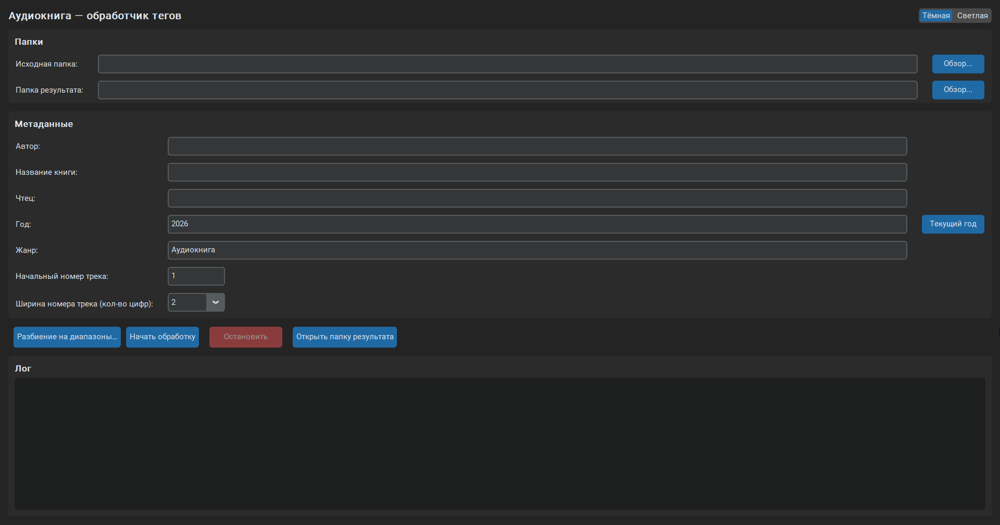
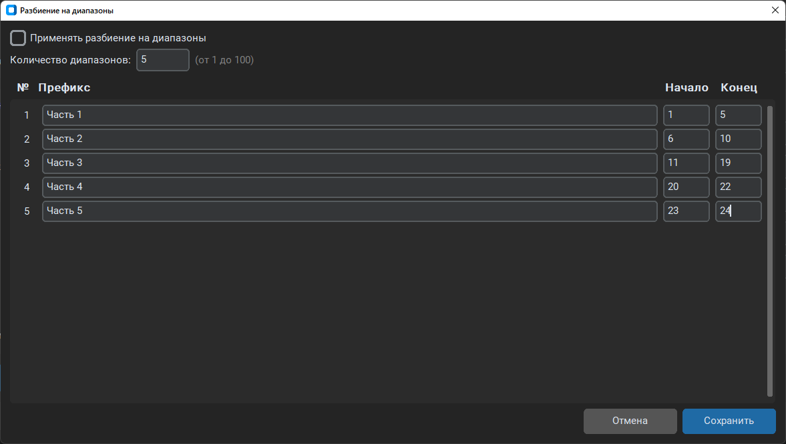

# 📖 Аудиокнига — обработчик тегов

**Audiobook Tagger** — десктопное приложение на Python с графическим интерфейсом, предназначенное для массового добавления и редактирования ID3-тегов в MP3-файлах аудиокниг.

Программа автоматически копирует файлы из выбранной папки в папку результата, присваивает каждому треку единообразные теги (название главы, автор, год, жанр, номер трека и др.) и позволяет удобно управлять нумерацией.

---

## 🚀 Возможности

- ✅ **Пакетная обработка** всех MP3-файлов в выбранной папке
- ✅ **Автоматическое копирование** файлов в папку результата
- ✅ **Применение ID3-тегов** к каждому файлу:
  - Название главы (`TIT2`) — формируется автоматически по номеру трека
  - Исполнитель / автор (`TPE1`)
  - Альбом / название книги (`TALB`)
  - Исполнитель альбома / чтец (`TPE2`)
  - Год издания (`TDRC`)
  - Жанр (`TCON`) — по умолчанию «Аудиокнига»
  - Номер трека (`TRCK`) — с настраиваемой шириной и ведущими нулями
- ✅ **Гибкая нумерация** — можно задать начальный номер и количество цифр
- ✅ **Разбиение треков на диапазоны** к каждому диапазону можно задать свой префикс
- ✅ **Тёмная/светлая тема**
- ✅ **Лог выполнения** с отображением прогресса и ошибок
- ✅ **Остановка обработки** в любой момент
- ✅ **Горячие клавиши** `Ctrl+A/C/X/V` работают независимо от раскладки клавиатуры
- ✅ Открытие папки результата одним кликом

---

## 🖥️ Скриншот






---

## ⚙️ Требования

- Python 3.8 или выше
- Поддерживаемые ОС: Windows

---

## 📦 Установка

```bash
git clone https://github.com/LomakinVladislav/audiobook-tagger.git
cd audiobook-tagger
python -m venv venv
venv\Scripts\activate         # Windows
pip install -r requirements.txt
python main.py
```


## 🧩 Как использовать

1. Выберите исходную папку с MP3-файлами аудиокниги.

2. Выберите папку результата (будет создана автоматически, если её нет).

3. Заполните метаданные (автор, название, чтец, год, жанр).

4. Укажите начальный номер трека (по умолчанию 1).

5. Укажите ширину номера трека — количество цифр с ведущими нулями (например, 2 → 01, 3 → 001).

6. Нажмите "Разбиение на диапазоны" для того, чтобы нумерация обнулялась автоматически. Вы также можете добавить префикс, который будет отображаться у первого файла в диапазоне.

7. Нажмите «Начать обработку».

8. Следите за процессом в логе.

9. При необходимости остановите обработку кнопкой «Остановить».

10. Откройте папку результата кнопкой «Открыть папку результата»

🧠 Пример тегов

| Тег | Значение |
|-----|----------|
| `TIT2` (название) | `Глава 005` |
| `TRCK` (номер) | `005/012` (если всего 12 треков) |
| `TPE1` | `Лев Толстой` |
| `TALB` | `Война и мир` |
| `TPE2` | `Вячеслав Герасимов` |
| `TDRC` | `2026` |
| `TCON` | `Аудиокнига` |

📁 Структура проекта
```
audiobook-tagger/
├── main.py # основной код приложения
├── requirements.txt # зависимости
└── README.md 
```

🤝 Вклад в проект

Буду рад любым предложениям, улучшениям и сообщениям об ошибках.
Создавайте Issues или Pull Requests — я обязательно рассмотрю!

📄 Лицензия
MIT License — используйте свободно, изменяйте, распространяйте.

👤 Автор

Ломакин Владислав
GitHub: [LomakinVladislav](https://github.com/LomakinVladislav)

Сделано с ❤️ для любителей аудиокниг